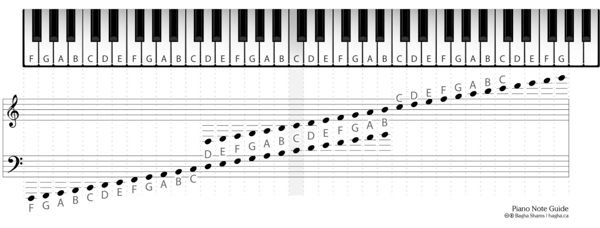
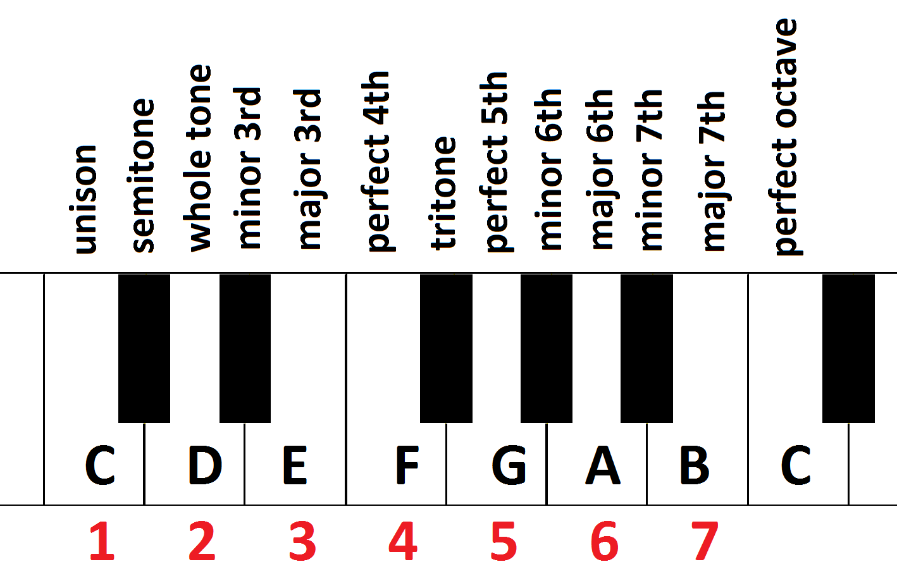

# Piano Theory

## Piano Notes

  


## Intervals

Minor 2nd - 1 note distance.  
Major 2nd - 2 notes distance.  



## Chords

### Triads
Major chord = Root + Major 3rd + Minor 3rd  
Minor chord = Root + Minor 3rd + Major 3rd  

### Diminished/Augmented chords
Diminished chord = Minor 3rd + Minor 3rd      
Augmented chord = Major 3rd + Major 3rd      


## Chord notes

### Triads
```
A  - A  C# E  
A  - A  C  E  
 
C  - C  E  G     
Cm - C  D# G     

D  - D  F# A   
D# - D  F  A   

E  - E  G# B   
Em - E  G  B   
```

## Scales

Major - W W H W W W H  
Minor - 